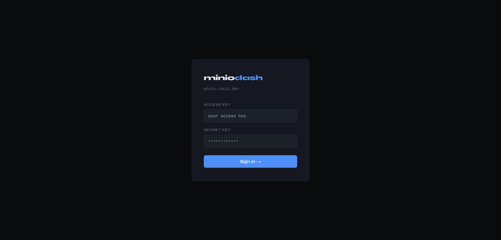
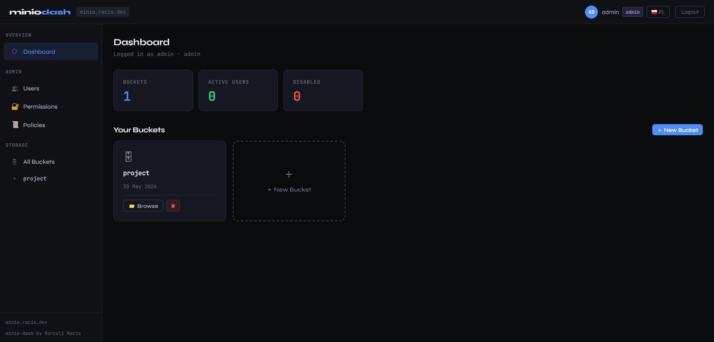
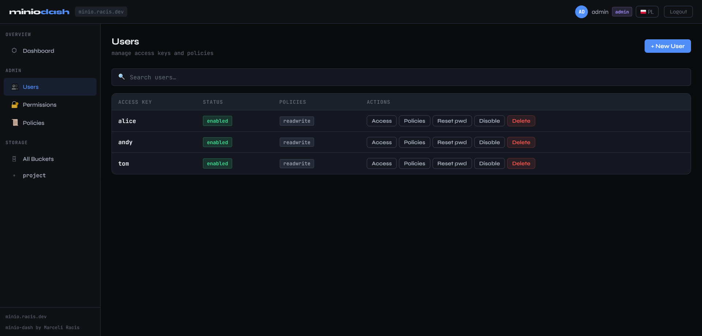
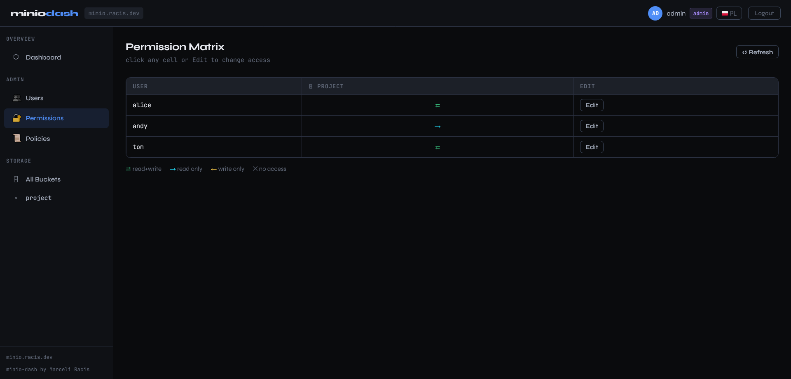
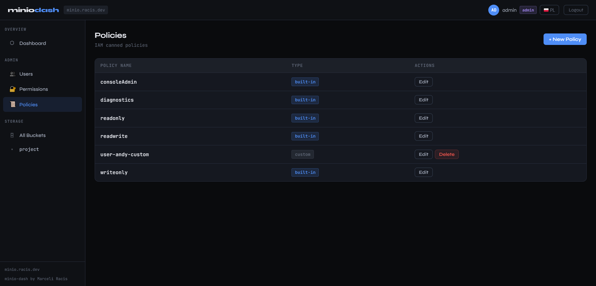

<div align="center">

# minio-dash

**Full S3 admin dashboard for MinIO — no `mc` CLI needed**

[](LICENSE)
[](https://github.com/MarceliRacis/minio-dash/commits/main)
[](tests/)
[](https://www.docker.com)
[](https://flask.palletsprojects.com)

[](https://min.io)
[](https://jwt.io)
[](https://gunicorn.org)

[](https://racis.dev/works/minio-dash)
[](https://git.racis.dev/marceliracis/minio-dash)
[](https://github.com/MarceliRacis/minio-dash)

A web-based admin panel for MinIO — manage buckets, files, users, policies and permissions directly in the browser.
Uses the MinIO Python SDK and admin REST API with AWS Signature V4 signing. No external tools required.

[**Project page**](https://racis.dev/works/minio-dash) · [**GitLab (source)**](https://git.racis.dev/marceliracis/minio-dash) · [**GitHub (mirror)**](https://github.com/MarceliRacis/minio-dash)

[Roadmap](ROADMAP.md) · [Contributing](CONTRIBUTING.md) · [Try it without a MinIO server](#preview-mode)

</div>

---

## Screenshots

<div align="center">

**Login**


**Dashboard**


**Users**


**Permission Matrix**


**Policies**


</div>

---

## Features

- **Bucket management** — create, delete (with optional force-delete of all contents), browse
- **File browser** — upload, download, view inline, rename, delete, create folders, generate share links
- **User management** — create/delete users, enable/disable accounts, reset passwords, assign policies
- **Policy management** — list, view, create and delete IAM policies
- **Permission matrix** — visual table showing which user has read/write access to which bucket
- **Bucket-level access editor** — set per-bucket `r` / `w` / `rw` / `none` for any user via auto-generated custom policy
- **JWT authentication** — login with MinIO access key + secret key; sessions last 8 hours
- **Admin auto-detection** — automatically detects if the logged-in user has admin privileges
- **i18n** — English and Polish UI (🇬🇧 / 🇵🇱)
- **Preview mode** — `MODE=PREVIEW` runs the whole panel against a disposable in-memory sandbox, so you can demo or evaluate it without a MinIO server
- **Tested** — 129 automated tests covering auth, SigV4 signing, crypto and policy parsing; CI blocks the image build if they fail
- **Multi-arch Docker image** — runs on both `amd64` and `arm64`

---

## Quick Start (Docker) ⭐

### 1. Configure environment

```bash
python server.py --init-env
```

That writes a ready-to-run `.env` with freshly generated `SECRET_KEY` and
`ENCRYPTION_KEY` (mode `0600`), so the only thing left to set is your
`MINIO_ENDPOINT`. It refuses to overwrite an existing `.env`.

Prefer to do it by hand? `cp .env.example .env` and fill in:

```env
MINIO_ENDPOINT=https://s3.example.com
SECRET_KEY=your-long-random-jwt-secret
ENCRYPTION_KEY=your-long-random-aes-key
PORT=7474
WEBUI_HOST=https://minio-dash.example.com
GUNICORN_WORKERS=2
GUNICORN_THREADS=8
```

Generating those two by hand:

```bash
python -c "import secrets; print(secrets.token_hex(32))"   # SECRET_KEY
python -c "import secrets; print(secrets.token_hex(16))"   # ENCRYPTION_KEY
```

> **Note:** `SECRET_KEY` and `ENCRYPTION_KEY` are **both required** — the server exits with an error at startup if either is missing (unless `DEBUG=1` is set, which uses insecure dev-only defaults). They are **not** auto-generated. Use a persistent value so sessions survive restarts.

### 2. Run

**With Docker Compose (recommended):**

```bash
docker compose up -d
```

**Using the prebuilt image directly:**

```bash
docker run -d \
  --name minio-dash \
  --restart unless-stopped \
  -p 7474:7474 \
  -e MINIO_ENDPOINT=https://s3.example.com \
  -e SESSION_BACKEND=jwt \
  -e SECRET_KEY=changeme \
  -e ENCRYPTION_KEY=changeme-encryption-key \
  -e PORT=7474 \
  -e WEBUI_HOST=https://minio-dash.example.com \
  -e GUNICORN_WORKERS=2 \
  -e GUNICORN_THREADS=8 \
  registry.racis.dev/marceliracis/minio-dash:latest
```

**Using with Redis (Stateful session storage):**

```bash
docker run -d \
  --name minio-dash-redis \
  --restart unless-stopped \
  -p 7474:7474 \
  -e MINIO_ENDPOINT=https://s3.example.com \
  -e SESSION_BACKEND=redis \
  -e REDIS_URL=redis://your-redis-host:6379/0 \
  -e SECRET_KEY=changeme \
  -e PORT=7474 \
  registry.racis.dev/marceliracis/minio-dash:latest
```

**Build from source:**

```bash
docker build -t minio-dash .

docker run -d \
  --name minio-dash \
  --restart unless-stopped \
  -p 7474:7474 \
  --env-file .env \
  minio-dash
```

### 3. Open

```
http://localhost:7474
```

Log in with your MinIO **access key** (username) and **secret key** (password).

---

## How It Works

1. **Log in** — enter your MinIO access key and secret key.
2. The server verifies credentials against your MinIO instance. Admin privileges are auto-detected.
3. A signed **JWT token** (HS256, TTL 8h) is generated.
4. **Session Storage**: Depending on `SESSION_BACKEND`, credentials are either encrypted inside the JWT (stateless) or stored in Redis (stateful).
5. The token is stored in a **Secure, HttpOnly Cookie**, protecting it from XSS attacks.
6. All subsequent API calls are authenticated via this cookie and protected by **CSRF validation** (X-Requested-With header).

---

## Authentication & Security

minio-dash uses industry-standard security practices to protect your S3 credentials:

- **No Local Storage**: JWT is stored in an `HttpOnly` cookie. JavaScript cannot access it.
- **CSRF Protection**: All modifying requests (`POST`, `PUT`, `DELETE`) require an `X-Requested-With` header.
- **Session Flexibility**: Choose between stateless JWT-based sessions or stateful Redis-based sessions.
- **Encryption**: In `jwt` mode, S3 credentials are encrypted with `AES-256-GCM` before being placed in the token payload.

| Security Layer | Mechanism |
|-----------------|-------|
| **JWT Storage** | `HttpOnly`, `SameSite=Lax` Cookie |
| **CSRF** | Mandatory `X-Requested-With: XMLHttpRequest` header |
| **Encryption** | `AES-256-GCM` (using `ENCRYPTION_KEY`) |

Admin-only endpoints return `403 Forbidden` if the logged-in user does not have MinIO admin privileges.

---

## Running Locally Without Docker

```bash
# Install dependencies
pip install flask minio PyJWT gunicorn pycryptodome

# Or using requirements.txt
pip install -r requirements.txt

# Set env vars and start (Stateless JWT mode)
MINIO_ENDPOINT=https://s3.example.com \
SESSION_BACKEND=jwt \
SECRET_KEY=your-jwt-secret \
ENCRYPTION_KEY=your-aes-key \
PORT=7474 \
WEBUI_HOST=https://minio-dash.example.com \
GUNICORN_WORKERS=2 \
GUNICORN_THREADS=1 \
python server.py

# Or with Redis backend (Stateful mode)
MINIO_ENDPOINT=https://s3.example.com \
SESSION_BACKEND=redis \
REDIS_URL=redis://localhost:6379/0 \
SECRET_KEY=your-jwt-secret \
PORT=7474 \
python server.py
```

---

## Production Deployment (VPS)

1. Set `MINIO_ENDPOINT` to your MinIO instance URL
2. Set persistent `SECRET_KEY` and `ENCRYPTION_KEY`
3. Place a reverse proxy (nginx or Caddy) in front of port 7474

**nginx config:**

```nginx
server {
    server_name minio-dash.yourdomain.com;

    location / {
        proxy_pass http://localhost:7474;
        proxy_http_version 1.1;
        proxy_set_header Host $host;
        proxy_set_header X-Real-IP $remote_addr;
        proxy_set_header X-Forwarded-Proto $scheme;

        # Required for large file uploads/downloads
        client_max_body_size 0;
        proxy_read_timeout 300s;
        proxy_send_timeout 300s;
    }
}
```

---

## Preview mode

Want to see what the panel does before wiring it to your own MinIO? Run it in
preview mode:

```bash
MODE=PREVIEW python server.py
# or
docker run -d -p 7474:7474 -e MODE=PREVIEW \
  registry.racis.dev/marceliracis/minio-dash:latest
```

No `MINIO_ENDPOINT`, no secrets, no MinIO server. The whole panel runs against
an in-memory stand-in (`preview.py`) seeded with demo buckets, files, users and
IAM policies. Sign in with anything — or nothing — and click around: create
buckets, upload files, edit the permission matrix, reset passwords. Everything
works, and none of it is real.

How it behaves:

- **Every visitor gets their own sandbox.** Nothing you do is visible to anyone
  else, and each sign-in starts from clean demo data.
- **Nothing persists.** Sandboxes live in RAM, expire after two hours of
  inactivity, and vanish on restart.
- **No MinIO connection is ever opened.** The real client is never constructed;
  there is a test asserting exactly that.
- **Secrets are optional.** If `SECRET_KEY` / `ENCRYPTION_KEY` are unset,
  ephemeral ones are generated for the process.

Because sandbox state lives in the process's memory, preview mode forces
`workers=1` and scales with threads instead.

> Preview mode is for demos and evaluation. It is not a MinIO emulator, and it
> implements only the operations this panel calls.

---

## Environment Variables

| Variable | Required | Default | Description |
|----------|----------|---------|-------------|
| `MINIO_ENDPOINT` | ✅ | `localhost:9000` | MinIO endpoint (with or without `https://`) |
| `SECRET_KEY` | ✅ | _(none — required)_ | JWT signing secret — server exits if unset (unless `DEBUG=1`) |
| `ENCRYPTION_KEY` | ✅ | _(none — required)_ | AES key for encrypting S3 creds — server exits if unset (unless `DEBUG=1`) |
| `SESSION_BACKEND`| ❌ | `jwt` | Session storage: `jwt` (stateless) or `redis` (stateful) |
| `REDIS_URL` | ⚠️ | None | Required if `SESSION_BACKEND=redis` |
| `PORT` | ❌ | `7474` | HTTP port to listen on |
| `WEBUI_HOST` | ❌ | `http://localhost:7474` | Public URL shown in startup banner |
| `GUNICORN_WORKERS` | ❌ | `2` | Number of Gunicorn worker processes |
| `GUNICORN_THREADS` | ❌ | `8` | Threads per worker. Requests spend most of their time waiting on MinIO, so threads are what give you concurrency — a large upload occupies its thread for the whole transfer |
| `MODE` | ❌ | _(none)_ | Set to `PREVIEW` to run against a disposable in-memory sandbox instead of a real MinIO server (see [Preview mode](#preview-mode)) |
| `DEBUG` | ❌ | _(off)_ | Dev only. Enables insecure key fallbacks and the `/api/debug-users` endpoint. Never set in production |

> **Security Note:** `SECRET_KEY` and `ENCRYPTION_KEY` are mandatory. If either is missing the server refuses to start (exits with an error) unless `DEBUG=1` is set, which falls back to insecure hardcoded keys for local development only — never use `DEBUG=1` in production.

---

## API Reference

All endpoints (except `/api/login`) require a valid session cookie and `X-Requested-With: XMLHttpRequest` header for write operations.

### Auth

| Method | Endpoint | Auth | Description |
|--------|----------|------|-------------|
| `POST` | `/api/login` | — | Login with `{username, password}` → returns JWT |
| `POST` | `/api/logout` | User | Invalidates session |
| `GET` | `/api/me` | User | Returns current user info + admin flag |

### Buckets

| Method | Endpoint | Auth | Description |
|--------|----------|------|-------------|
| `GET` | `/api/buckets` | User | List all buckets |
| `POST` | `/api/buckets` | Admin | Create bucket `{name}` |
| `DELETE` | `/api/buckets/:bucket` | Admin | Delete bucket; `{force: true}` removes all objects first |
| `GET` | `/api/buckets/:bucket/info` | User | Object count and total size |
| `GET` | `/api/buckets/:bucket/policy` | Admin | Get bucket IAM policy |
| `PUT` | `/api/buckets/:bucket/policy` | Admin | Set or delete bucket IAM policy |

### Files

| Method | Endpoint | Auth | Description |
|--------|----------|------|-------------|
| `GET` | `/api/buckets/:bucket/files?prefix=` | User | List files/folders at prefix |
| `POST` | `/api/buckets/:bucket/files/upload?prefix=` | User | Upload file (multipart) |
| `GET` | `/api/buckets/:bucket/files/view?key=` | User | Stream file (inline for images, video, PDF, text) |
| `GET` | `/api/buckets/:bucket/files/download?key=` | User | Force-download file |
| `POST` | `/api/buckets/:bucket/files/delete` | User | Delete file or folder `{key, recursive?}` |
| `POST` | `/api/buckets/:bucket/files/rename` | User | Rename/move `{src, dst}` |
| `POST` | `/api/buckets/:bucket/files/mkdir` | User | Create folder `{prefix, name}` |
| `POST` | `/api/buckets/:bucket/files/share` | User | Generate presigned URL `{key, expire}` (hours, default 168) |

### Users

| Method | Endpoint | Auth | Description |
|--------|----------|------|-------------|
| `GET` | `/api/users` | Admin | List all users with status and policies |
| `POST` | `/api/users` | Admin | Create user `{username, password?, policies?}` |
| `DELETE` | `/api/users/:username` | Admin | Delete user |
| `POST` | `/api/users/:username/enable` | Admin | Enable user |
| `POST` | `/api/users/:username/disable` | Admin | Disable user |
| `GET` | `/api/users/:username/info` | Admin | Get full user info |
| `GET` | `/api/users/:username/policies` | Admin | List user's policies |
| `PUT` | `/api/users/:username/policies` | Admin | Replace user's policies `{policies: [...]}` |
| `POST` | `/api/users/:username/reset-password` | Admin | Generate and set a new random password |
| `PUT` | `/api/users/:username/bucket-access` | Admin | Set per-bucket access `{access: {bucket: 'rw'\|'r'\|'w'\|'none'}}` |

### Policies

| Method | Endpoint | Auth | Description |
|--------|----------|------|-------------|
| `GET` | `/api/policies` | Admin | List all policies |
| `GET` | `/api/policies/:name` | Admin | Get policy JSON |
| `POST` | `/api/policies` | Admin | Create policy `{name, policy}` |
| `DELETE` | `/api/policies/:name` | Admin | Delete policy |

### Permission Matrix

| Method | Endpoint | Auth | Description |
|--------|----------|------|-------------|
| `GET` | `/api/permission-matrix` | Admin | Returns `{users, buckets, matrix, userPolicies}` |

---

## Project Structure

```
minio-dash/
├── Dockerfile                  # Python 3.11-slim image
├── docker-compose.yml
├── .env.example
├── requirements.txt
├── requirements-dev.txt        # + test dependencies
├── server.py                   # Flask app — all routes, JWT auth, MinIO SDK
├── preview.py                  # In-memory MinIO stand-in for MODE=PREVIEW
├── ui.html                     # Single-file frontend (HTML + CSS + JS)
├── locales/
│   ├── en.json                 # English translations
│   └── pl.json                 # Polish translations
├── screens/                    # Screenshots used in this README
└── tests/                      # pytest suite — no MinIO or network needed
    ├── test_auth.py            # JWT, CSRF, endpoint guards
    ├── test_crypto.py          # AES-GCM sealing, key derivation
    ├── test_sigv4.py           # Admin API request signing
    ├── test_policy_parsing.py  # Permission matrix logic
    ├── test_endpoints.py       # Routing, i18n, login validation
    └── test_preview.py         # Preview sandbox
```

---

## Tests

```bash
pip install -r requirements-dev.txt
python -m pytest
```

129 tests, roughly two seconds, no MinIO server, no Redis and no network
required. CI runs them on every push that touches code, and a failing suite
blocks the Docker image build.

The suite deliberately concentrates on the parts that are hand-written and
security-relevant rather than chasing a coverage number: AES-GCM credential
sealing and its key derivation, JWT issuing and rejection (expired, wrong
secret, `alg: none`), the CSRF double-submit check, the auth and admin guards in
front of every endpoint, AWS SigV4 request signing for the MinIO admin API, and
the IAM policy parsing behind the permission matrix.

See [CONTRIBUTING.md](CONTRIBUTING.md) for what to be careful about when
changing them.

---

## Useful Docker Commands

```bash
# Pull latest image
docker pull registry.racis.dev/marceliracis/minio-dash:latest

# Start in background
docker compose up -d

# Stop
docker compose down

# View logs
docker compose logs -f

# Check container status
docker ps | grep minio-dash

# Open a shell inside the container (debug)
docker exec -it minio-dash sh

# Build and push a new version
docker build -t registry.racis.dev/marceliracis/minio-dash:latest .
docker push registry.racis.dev/marceliracis/minio-dash:latest
```

---

## Project status

Worth being straight about, since it is a fair thing to ask before you run
someone's admin panel against your storage.

**This is a single-maintainer project.** It is built and maintained by one
person, in his own time, because he needed the tool. If that is a dealbreaker
for your environment, it should be — and no amount of stars would change it.

What is done about it instead:

- **MIT licensed, and small enough to actually take over.** Roughly 3.5k lines
  across two main files, plain Flask and plain HTML, no framework magic, no
  build step, no code generation. Forking it and understanding it is an
  afternoon, not a project.
- **No lock-in, by construction.** Everything the panel does, it does through
  the standard MinIO S3 and admin APIs. It stores no state of its own, owns no
  database and no schema. Turn it off and your MinIO is exactly as it was —
  there is nothing to migrate off.
- **Tested, so it can be changed by someone who did not write it.** The parts
  that are hand-written and easy to break silently — request signing, crypto,
  auth, permission parsing — are pinned by tests, and CI blocks the image build
  if they fail.
- **Documented direction, including what will not be built.** See
  [ROADMAP.md](ROADMAP.md).
- **Clickable before you commit to it.** `MODE=PREVIEW` lets you evaluate the
  whole panel without pointing it at anything real.

Issues and feature requests are welcome and are the best way to influence what
gets built next: [GitLab issues](https://git.racis.dev/marceliracis/minio-dash/-/issues)
· [GitHub issues](https://github.com/MarceliRacis/minio-dash/issues).
Security reports: see [CONTRIBUTING.md](CONTRIBUTING.md#security).

### Thanks for the review

Thanks to the reviewers at
[pixapps.ai](https://pixapps.ai/jurypress/reviews/minio-aa8046-rb8ae8b/) for
taking the time to look at this properly. Four of their points landed, and this
release is the answer to them: the missing test suite is now 129 tests wired
into CI, the manual secret generation is a single `--init-env`, the absent
roadmap is [ROADMAP.md](ROADMAP.md), and the "no way to try it without
committing" problem is `MODE=PREVIEW`. The bus-factor concern is real and is
addressed as honestly as it can be, above. Good critique is more useful than
praise.

---

## License

[MIT](LICENSE) © [Marceli Racis](https://racis.dev)
